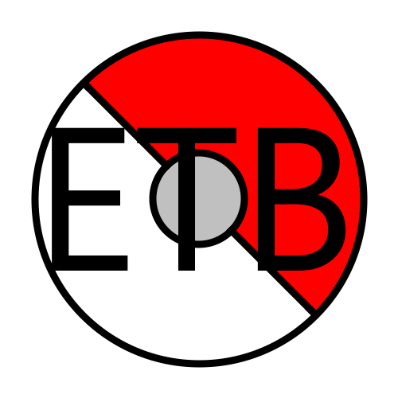

    
    <h1>Essentials Team Builder</h1>

  English / <a href=".github/README-es.md">Español</a> / <a href=".github/README-fr.md">Français</a> / <a href=".github/README-de.md">Deutsch</a> / <a href=".github/README-it.md">Italiano</a> / <a href=".github/README-zhHK.md">繁體中文</a> / <a href=".github/README-zh.md">简体中文</a>

This tool is designed to help make the development of Pok&eacute;mon fan-games easier, by providing an easy-to-use GUI. Just fill out the required fields, click the "Generate/Preview" button, and you are done!

This is a fan-made tool. Pok&eacute;mon is not owned by TheCrafters001; Pok&eacute;mon is owned by GAME FREAK Inc. This tool does not allow you to create your own fan-games, rather it is to help aid you.

## Installing
To install this tool, you can download the lastest version [here](https://github.com/TheCrafters001/essentials-team-builder/releases/latest).

### Building from Source
To build this software, you will need to download [Visual Studio](https://visualstudio.com/) 2017 or higher.
